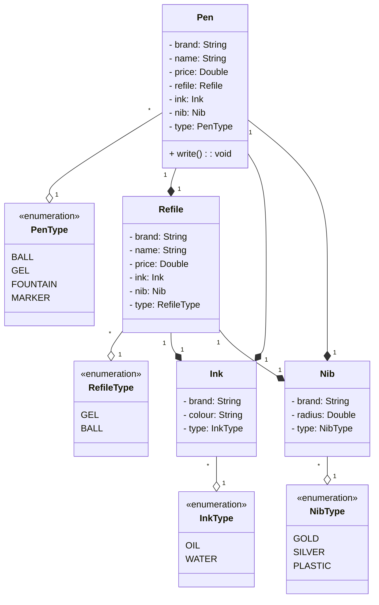
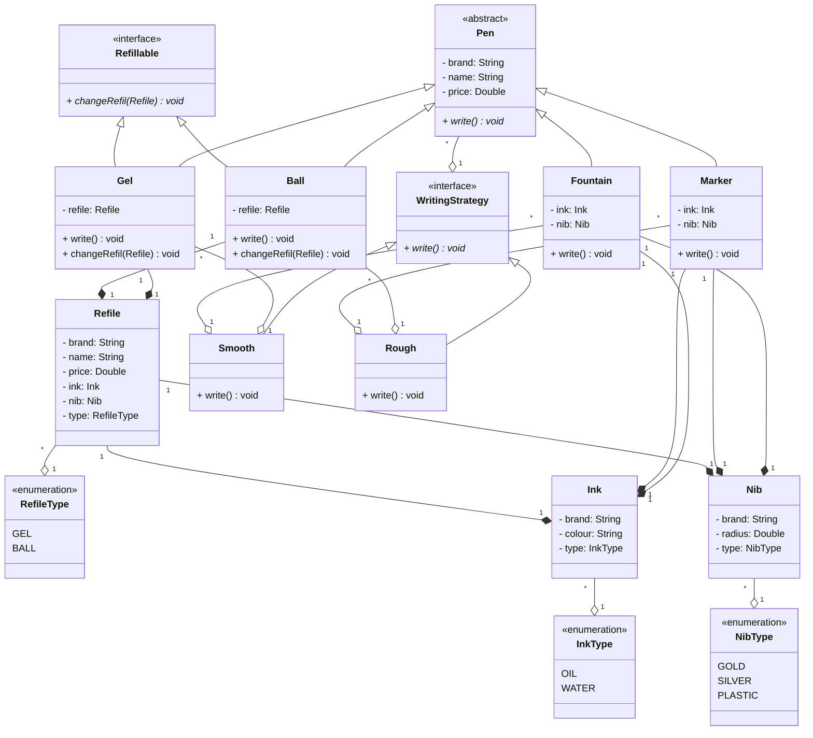

# 🖊️ Design A Pen

_A recent interview question I got in a company's Low-Level Design (LLD) round._

---

### 👤 I asked:
> Is this a real-world entity or an application?

### 🧑‍💼 Interviewer answered:
> This is a real-world entity that can write, and it has a **brand**, **name**, and **price**.

---

### 👤 I asked:
> As in, real-world pens have various types. Will all those types be applicable?

### 🧑‍💼 Interviewer answered:
> Yes, keep it limited to **4 types**:
> - **Ball Pen**
> - **Gel Pen**
> - **Fountain Pen**
> - **Marker**

---

### 👤 I asked:
> Will there be refills as well?

### 🧑‍💼 Interviewer answered:
> Yes, definitely.
> - **Gel Pen** and **Ball Pen** will have **refills** of their type.
> - **Fountain Pen** and **Marker** will **not** have refills, but they can **hold ink directly**.
> - Refills will also contain **ink**.
> - Ink can have **different colors** and **types**.

---

### 👤 I asked:
> Do refills have a nib? And do Fountain Pens and Markers also have a nib?

### 🧑‍💼 Interviewer answered:
> Yes, all of them have a **nib**.
> - A **nib** has a **radius**
> - A **nib** has **types** (e.g., fine, medium, broad, etc.)

---

## ✅ Requirements

- A **Pen** is anything that can write.
- Pens can be of type: **Gel**, **Ball**, **Fountain**, or **Marker**.
- **Ball Pen** and **Gel Pen** have corresponding **refills**.
- A **Refill** has a **nib** and **ink**.
- **Ink** can be of different **colors** and **types**.
- A **Fountain Pen** has **ink** but no refill.
- A **Refill** has a **radius**.
- For a **Fountain Pen**, its **nib** has a **radius**.
- Each pen writes differently.
- Some pens may write similarly.
- Every pen has a **brand** and a **name**.
- Some pens may allow **refilling**, while others may not.

---

## 🧩 Entities and Attributes

### Pen
- `brand`
- `name`
- `price`
- `refile`
- `ink`
- `nib`
- `type`

### Refile
- `brand`
- `name`
- `price`
- `ink`
- `nib`
- `type`

### Ink
- `brand`
- `colour`
- `type`

### Nib
- `brand`
- `radius`
- `type`

---

## 📐 Class Diagram (Version 1)

---

## 🧠 Interviewer Feedback

### ✅ Overall Impression:
You're thinking in the right direction — identifying entities, attributes, and including a class diagram. This shows you're comfortable with system modeling and abstraction.

---

### ⚠️ Areas of Concern & Immediate Improvement:

#### 1. **Single Responsibility Principle (SRP)**
- The `Pen` class currently takes on too many responsibilities (e.g., ink handling, refill logic, nib configuration, and writing behavior).
- This violates SRP and makes the class harder to modify or test independently.

#### 2. **Open/Closed Principle (OCP)**
- The system is not easily extendable.
- Adding new types of pens requires modifying existing logic in `Pen`, which violates OCP.

#### 3. **Liskov Substitution Principle (LSP)**
- Treating all pens as if they support both refill and ink equally can result in invalid substitutions.
- For example, a `FountainPen` should not be expected to behave like a `GelPen` that uses a refill.

---

### 🧩 Design Behavior Missing
- The current design doesn’t clearly define **how** each pen "writes differently".
- Extracting `writeBehavior` into separate strategies or interfaces could better model this behavior and align with polymorphism.

---

### 📌 Final Note:
Solid grasp of object modeling, but immediate focus should be on refining your design for SRP, LSP, and OCP adherence.

---

## 🔧 My Improvements

### 1. Use Abstract Class for `Pen`
- Define `Pen` as an abstract class.
- Create concrete subclasses for each pen type:
    - `BallPen`
    - `GelPen`
    - `FountainPen`
    - `MarkerPen`

### 2. Move Attributes to Appropriate Subclasses
- Move `refile` to `BallPen` and `GelPen` only.
- Move `ink` and `nib` to `FountainPen` and `MarkerPen`.

### 3. Introduce `Refillable` Interface
- Create a `Refillable` interface with a method `changeRefill()`.
- Let `BallPen` and `GelPen` implement `Refillable`.

### 4. Apply Strategy Design Pattern for Writing Behavior
- Create a `WritingStrategy` interface with a method like `write()`.
- Implement two strategies:
    - `SmoothWritingStrategy`
    - `RoughWritingStrategy`
- Each pen will have a `WritingStrategy` instance to delegate writing behavior.

---

## 📐 Class Diagram (Version 2)

